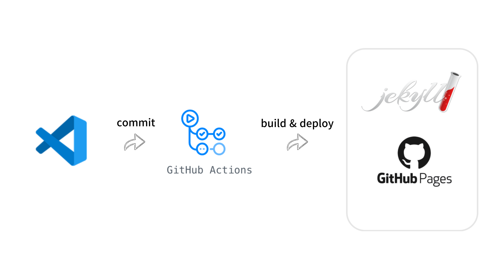
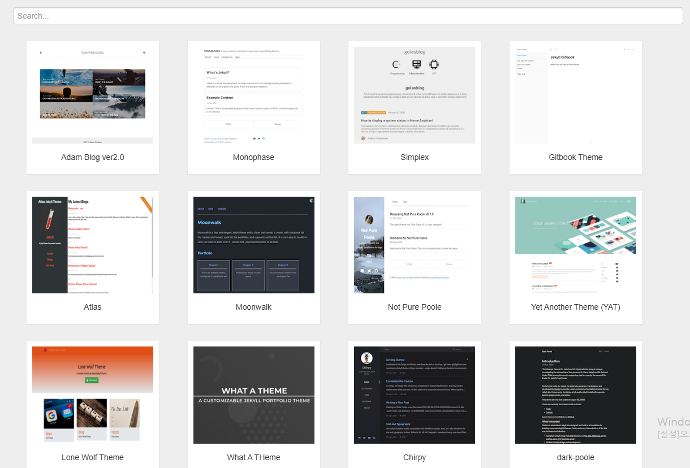

신년 들어서 마음가짐도 새롭게 할 겸 미뤄뒀던 블로그 옮기기를 하고자 했다.

기존에는 tistory를 사용하고 있었다.

하지만 tistory는 마크다운을 적용했을 때 어떻게 적용되는지 바로바로 확인이 불가하고 만약 블로그에 업로드한다 하더라도 내가 만든대로 적용되지 않았다.

또한 블로그의 컨셉을 바꾸고 싶었던 것도 있었다.

그동안은 내가 공부했던 것들을 올리곤 했는데 하면할수록 점점 보여주기 식이 되어간다는 느낌을 받았다.

그래서 이번 블로그에서는 다른 블로그에서도 볼 수 있는 단순 이론 정리가 아닌 문제 해결 과정이나 고민한 흔적, 프로젝트 설명, 경험 정리 등으로 채워나가보려 한다.

## 블로그 선택

다음 블로그 후보로는 velog, 노션, github blog 등이 있었다.

각각의 장점이 있었지만 CI/CD 파이프라인 학습과 블로그를 작성해도 잔디를 채울 수 있다는 장점으로 github blog를 선택했다.

전체적인 구조는 다음과 같다.



마크다운 에디터로 작성한 뒤 github repository에 commit 하면 github action에서 자동으로 build와 deploy를 해준다.

여기서 난 Jekyll이라는 정적 사이트를 생성하는데 도움을 주는 툴을 이용했다.

## 제작 과정

### 1. Jekyll 테마 다운로드

우선 Jekyll 테마부터 다운받자.

[Jekyll 테마 다운 홈페이지][1]



이 중 맘에 드는 테마를 고르면 된다.

여기서 고른 테마는 직접 다운로드 받거나 fork 해놓는다.

### 2. Github Pages 생성

Github Page 를 만드려면 Repository를 생성해야 한다.

Repository 이름을 [사용자 github 이름].github.io 로 생성한다.


사진에는 이미 있다고 뜨지만 처음 만든다면 초록색으로 뜰 것이다.

그 다음 Repository의 Settings -> Pages -> Build and deployment에서 Github Actions 를 선택해준다.


### 3. 프로젝트 구성

이제 github.io Repository에 다운받은 Jekyll Repository를 통째로 옮긴다.

각 테마별로 설정은 다르기 때문에 각 테마의 README.md를 보고 따라하는 것을 추천한다.

이부분은 모든 테마 공통이라고 생각되는데 Jekyll은 Ruby 기반으로 만들어져 있기 때문에 Ruby와 bundler를 설치한다.

나는 WindowOS를 사용하고 있기 때문에 RubyInstaller를 통해 Ruby를 다운받았다.

이 블로그의 경우 gitbook 테마를 사용했는데 Jekyll with Github Pages workflow를 그대로 설정값으로 사용했다.


여기서 각자 원하는 기능이 있다면 추가적으로 custom 하면 될 듯하다.

모든 설정이 완료되었다면 로컬에서 실행해본다.

```
bundle exec jekyll serve
```

문제없이 잘 작동하는 것을 확인.

### 4. Github에 Commit

이제 커밋 푸시하여 페이지가 배포되는지 확인해보자.


정상적으로 Build & deployment 가 이루어졌다면 이렇게 떠야한다.

### 로컬에서는 문제없는데 배포하면 CSS가 적용 안되는 오류 발생

\_config.yml 에서 base-url을 잘못 설정해서 그랬다.

보통 테마에서 파일을 긁어 왔다면 \_config.yml에 기본 사용자 github.io 주소가 작성되어 있을 것이다.

이를 내 github.io 주소로 변경해줘야 한다.

```
url: [내 github 아이디].github.io
baseurl: ""
```

이후 페이지에 접속해보면 정상적으로 배포된 것을 확인할 수 있다.


[1]: http://jekyllthemes.org/
